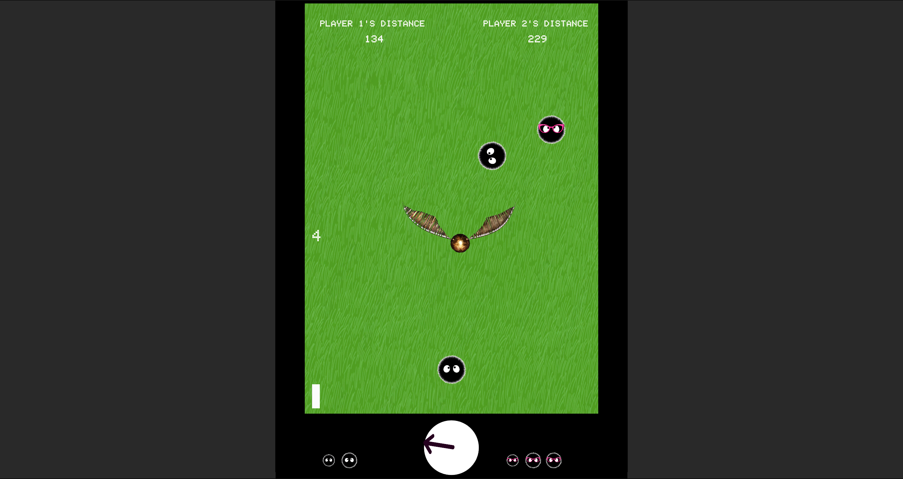
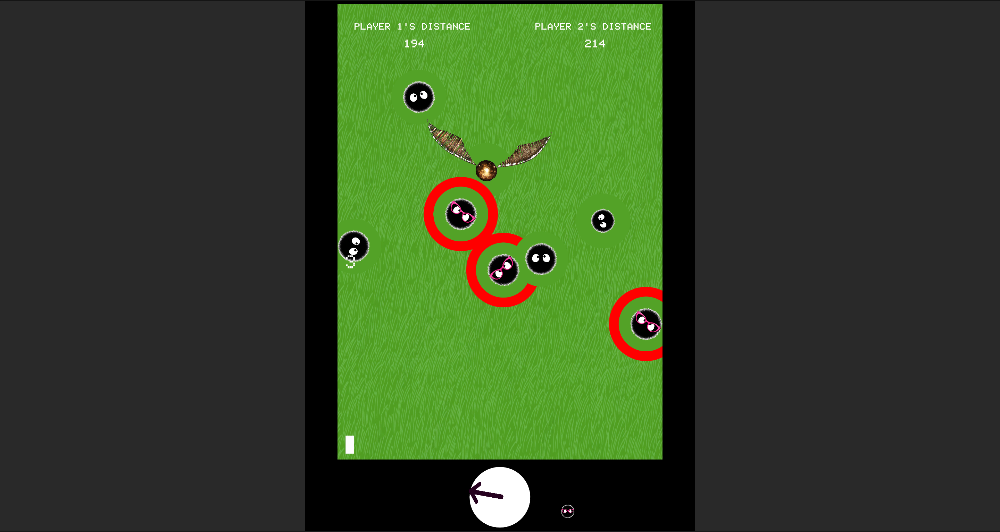

# 🌱 Roll to Root

"Roll to Root" is a game inspired by French Petanque, introducing unique gameplay dynamics. Players strategically aim to roll their balls as close as possible to the reference point, the "root". The game adds complexity with the introduction of parent and children balls, allowing players to outmaneuver opponents.

## 🎥 Demo
[Play the Game](https://wchan.itch.io/roll-to-root)

## 📸 Screenshots

 
 

## 🎲 Gameplay
- Each player starts with three balls
- The first player shoots the reference point as "root"
- Players take turns shooting their balls
- After all balls are shot, select one as the "parent ball" and place two "children balls" next to it
- Use children ball to move your own balls closer or push opponent's balls further away
- Score based on the average distance of all balls to the root

## 🕹️ Controls
`Space Bar` Increase shooting strength  
`Mouse` Adjust shooting direction  
`Left Mouse Button` Add children balls  

## 🛠️ Technologies Used
- Unity
- C#

## 👥 Contributors

- [Lei](https://github.com/srall123)
- [Linlin Sun](https://github.com/lanximaomao)
- [Stella-Kwon](https://github.com/Stella-Kwon)
- [Wing](https://github.com/wengcychan)
